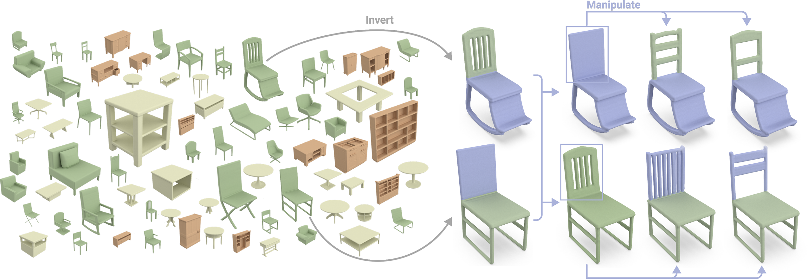

# Neural Wavelet-domain Diffusion for 3D Shape Generation [ACM TOG 2023]



For environment setup, we follow [Wavelet-Generation](https://github.com/edward1997104/Wavelet-Generation). 

# Dataset

For the dataset, we use the train/test split provided by [IM-NET](https://github.com/czq142857/IM-NET-pytorch) for training and evaluation. We provided the pre-computed data in this link: https://drive.google.com/file/d/1hGTDRLqf8GhCy5wnCGWIOxrIZ1bia9ZE/view?usp=sharing

# Training

To be released soon

# Inference

We provided our pre-trained models for shape inversion with the following link: https://drive.google.com/file/d/1wzUe35XclNQOdusdtwy3TP65jgIhg9Os/view?usp=sharing

You can download the pre-trained models and put it in the "./testing_folder"

You can run the inference by running:

```python
python eval_con_diffusion.py
```

